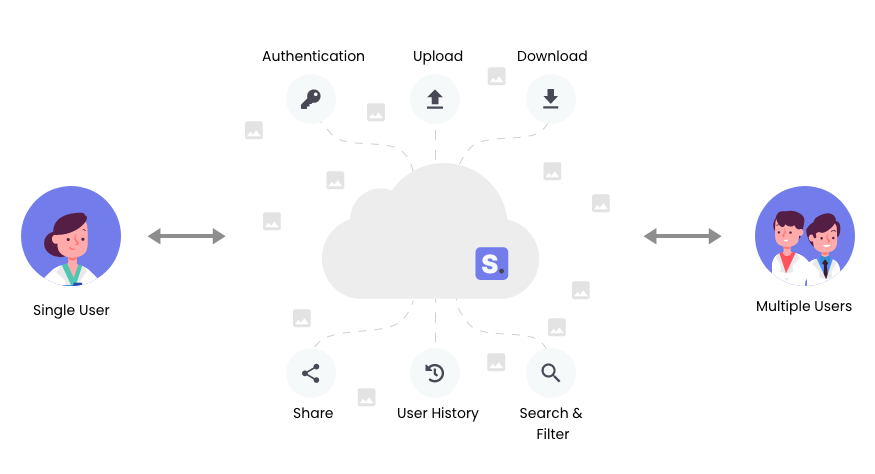
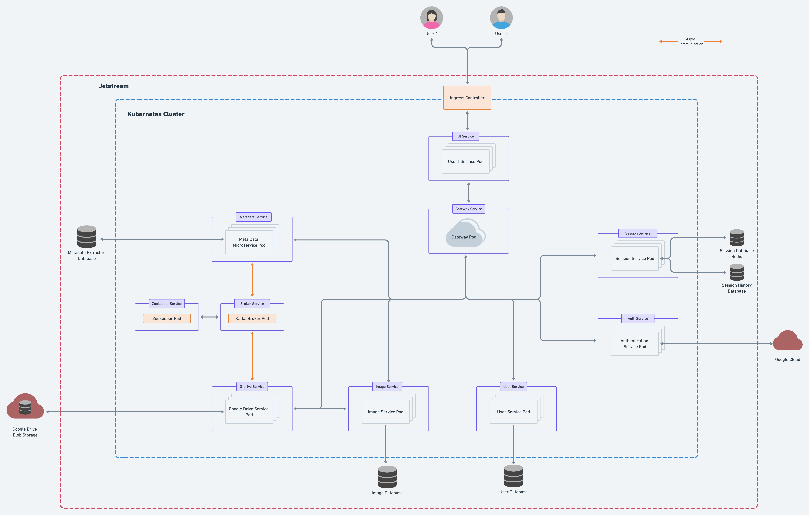
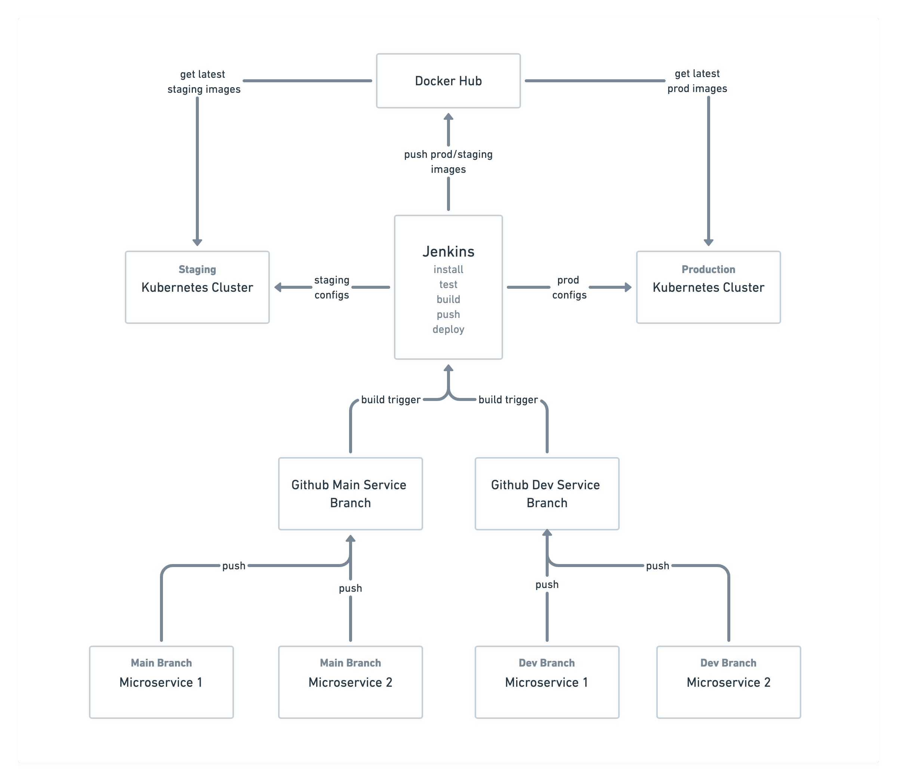
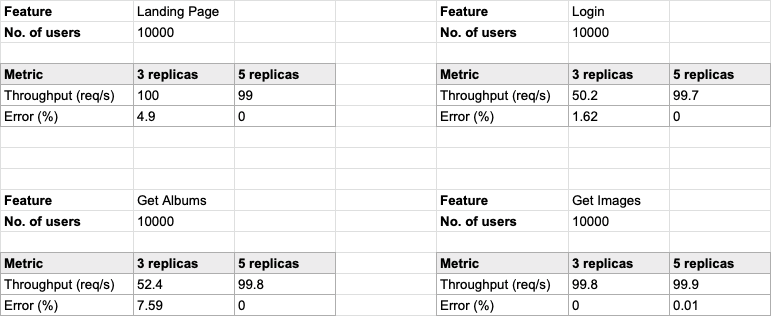

---

Scrapbook is a micro-service architecture-based application that enables users to upload and manage images. It empowers users to share images securely by introducing various roles. Users can also access an intuitive dashboard to view different metrics and monitor various activities. Scrapbook aims to introduce simplicity in photo management.

### 💻 [Production Demo](https://sb-ui-hrishikeshpaul.cloud.okteto.net/)



<br>

## 📦 Technology Stack

- Angular 11 (TypeScript)
- SpringBoot (Java 15)
- Flask (Python)
- MongoDB Atlas
- Redis Cloud
- Google Cloud Storage
- Apache Kafka
- RESTful Webservices
- Docker
- Jenkins
- Kubernetes
- Terraform
- Ansible
- Jmeter
- Google Kubernetes Engine

## 🏰 System Architecture



## 👨‍💻 System Workflow



## 🚀 Application Deployment

To create VMs and configure Kubernetes on the VMs, follow [zonca's blog](https://github.com/zonca/zonca-blog/blob/master/_posts/2021-01-20-jetstream_kubernetes_kubespray_2.15.0.md). Once you have the VMs set up, follow the steps below to deploy scrapbook on the cloud.

```
# SSH into the master node of the Kubernetes cluster
$ sudo su
$ git clone https://github.com/airavata-courses/scrapbook.git
$ cd scrapbook
$ chmod +x deploy.sh
$ ./deploy.sh
```

- The production version is currently deployed at https://sb-ui-hrishikeshpaul.cloud.okteto.net/
- [deprecated] The staging version is currently deployed at http://staging.scrapbook.rocks/
- [deprecated] Jenkins is currently deployed at http://149.165.171.239:8080/
- [deprecated] Redis instance is deployed at http://149.165.157.223:6379/
- [deprecated] MongoDB instance is deployed at http://149.165.172.158:27017/

#### Trigger a Production build

Push to the `main` branch, and Jenkins will automatically deploy the whole application.

#### Trigger a Staging build

Push to the `develop` branch, and Jenkins will automatically deploy the whole application.

## 🧱 Project Installation (Local)

### Dependencies

Please ensure you have these dependencies installed on your machine before installing each service.

- Node/NPM
- Python3.8
- Java 15
- MongoDB
- Redis
- Angular CLI
- Maven
- Docker

### Repository 
```
$ git clone https://github.com/airavata-courses/scrapbook.git
$ cd scrapbook
```

### Local Installation

#### Docker

```
# in the scrapbook root directory
$ git checkout docker
$ docker-compose up
```

Navigate to http://localhost:4200/

## 🎨 Performance

These are the load testing results for a few features.


